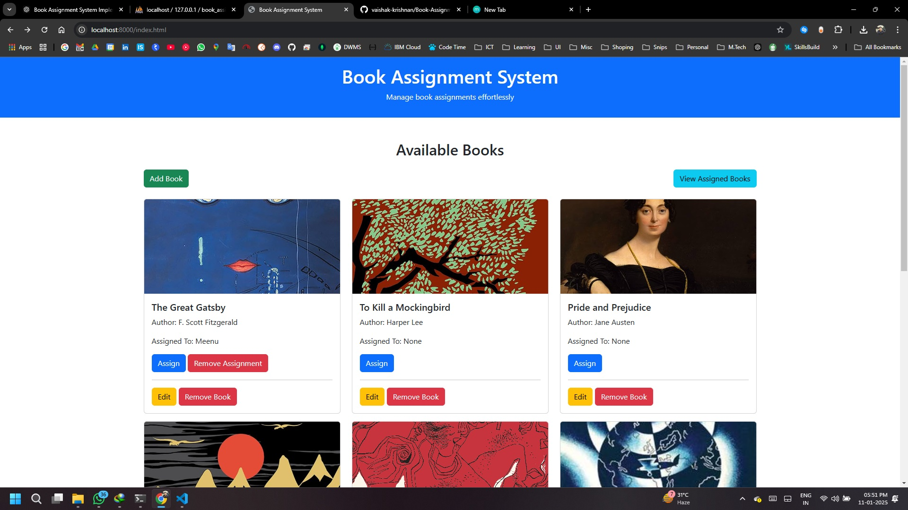
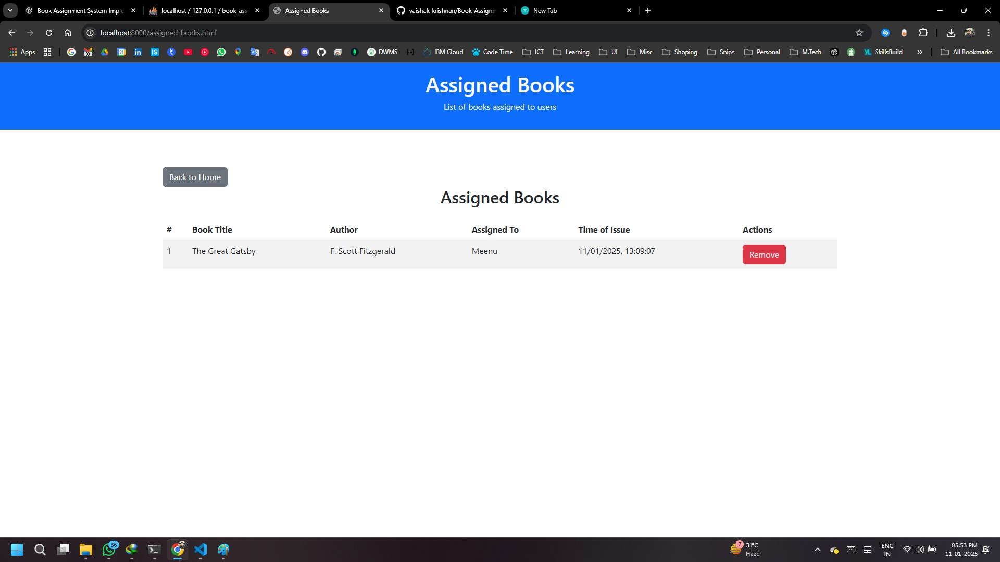

# Book Assignment System

A web-based application to manage book assignments. This system allows users to add books, assign books to individuals, view assigned books with details, and remove assignments as needed. Built using **HTML**, **CSS**, **JavaScript**, **PHP**, and **MySQL**, it features a clean and responsive design powered by **Bootstrap**.

---

## Features

- **Add Books**: Add new books with title, author, and image.
- **Edit Books**: Modify details of existing books.
- **Assign Books**: Assign books to users with a timestamp.
- **Remove Assignments**: Remove assignments for books.
- **View Assigned Books**: Display all assigned books, including user details and assignment time.
- **Responsive Design**: Fully responsive design using Bootstrap.

---

## Project Structure

```
book-assignment-system/
├── index.html               # Main page to manage books
├── assigned_books.html      # Page to view all assigned books
├── css/
│   └── style.css            # Custom styles
├── js/
│   └── scripts.js           # JavaScript for client-side functionality
├── php/
│   ├── assign_book.php      # Handle book assignments
│   ├── fetch_books.php      # Fetch book data
│   ├── manage_books.php     # Manage book records (add, edit, delete)
│   ├── assigned_books.php   # Fetch assigned book details
│   └── db_config.php        # Database connection
├── sql/
│   └── schema.sql           # Database schema and initial data
├── README.md                # Project documentation
└── LICENSE                  # Project license
```

---

## Technologies Used

- **Frontend**:
  - HTML5
  - CSS3
  - JavaScript (ES6+)
  - Bootstrap 5

- **Backend**:
  - PHP
  - MySQL

---

## Installation and Setup

### Prerequisites

- **Web Server**: [XAMPP](https://www.apachefriends.org/index.html) or [WAMP](https://www.wampserver.com/)
- **PHP**: Version 7.4 or higher
- **MySQL**: Version 5.7 or higher

### Steps

1. **Clone the Repository**
   ```bash
   git clone https://github.com/vaishak-krishnan/book-assignment-system.git
   ```

2. **Set Up Database**
   - Import the `sql/schema.sql` file into your MySQL database.
   - Update the database credentials in `php/db_config.php`:
     ```php
     <?php
     $servername = "localhost";
     $username = "root";
     $password = "";
     $dbname = "book_assignment";
     ?>
     ```

3. **Run the Application**
   - Place the project folder in your server’s document root (`htdocs` for XAMPP).
   - Start Apache and MySQL services.
   - Access the application in your browser:
     ```
     http://localhost/book-assignment-system/index.html
     ```

---

## SQL Commands

Use the following SQL commands to set up the database and required tables:

### Create Database
```sql
CREATE DATABASE book_assignment;
USE book_assignment;
```

### Create `books` Table
```sql
CREATE TABLE books (
    id INT AUTO_INCREMENT PRIMARY KEY,
    title VARCHAR(255) NOT NULL,
    author VARCHAR(255) NOT NULL,
    image_url TEXT,
    assigned_to VARCHAR(255),
    time_of_issue TIMESTAMP NULL DEFAULT NULL
);
```

### Insert Sample Data
```sql
INSERT INTO books (title, author, image_url) VALUES
('The Great Gatsby', 'F. Scott Fitzgerald', 'https://via.placeholder.com/150'),
('1984', 'George Orwell', 'https://via.placeholder.com/150'),
('To Kill a Mockingbird', 'Harper Lee', 'https://via.placeholder.com/150'),
('Pride and Prejudice', 'Jane Austen', 'https://via.placeholder.com/150'),
('The Hobbit', 'J.R.R. Tolkien', 'https://via.placeholder.com/150');
```

---

## Usage

1. **Managing Books**:
   - Add new books using the "Add Book" button.
   - Edit or delete books directly from the main page.

2. **Assigning Books**:
   - Click "Assign" to assign a book to a user.
   - View all assignments on the "View Assigned Books" page.

3. **Viewing Assigned Books**:
   - Navigate to the "Assigned Books" page to see all assignments, along with the time of issue.

4. **Removing Assignments**:
   - Use the "Remove" button on the "Assigned Books" page to remove a book assignment.

---

## Screenshots

## Screenshots

### Main Page (Manage Books)


### Assigned Books Page

---

## License

This project is licensed under the MIT License - see the [LICENSE](LICENSE) file for details.

---

## Contributing

Contributions are welcome! Please follow these steps:

1. Fork the repository.
2. Create a new branch (`git checkout -b feature-name`).
3. Commit your changes (`git commit -m 'Add some feature'`).
4. Push to the branch (`git push origin feature-name`).
5. Open a pull request.

---

## Acknowledgments

- **Bootstrap**: For the responsive design.
- **OpenAI's ChatGPT**: For project assistance.

---

## Contact

For any queries or suggestions, feel free to reach out:

- **Developer**: Vaishak C Krishnan
- **Email**: vaishak.krishnan@gmail.com
- **GitHub**: [vaishak-krishnan](https://github.com/vaishak-krishnan)

